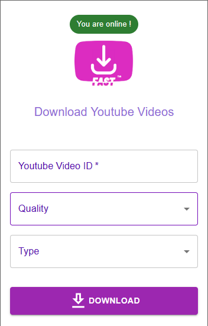
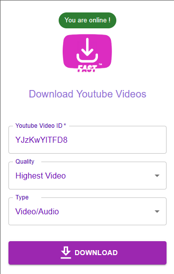

# FAST  V1.0.0

FAST is a browser extension that allows you to easily download videos from YouTube.

    

## Features V1.0.0

- The FAST extension offers the following features:

1. Easy to use interface for downloading YouTube videos
2. Fast and efficient downloading
3. Ability to download videos in various formats and quality levels
4. User-friendly experience

## Demo

    

    

    

## Main Technologies

- React
- Node.js

## Main packages

- Socket.io
- ytdl-core
- Material-ui

## Usage

### NB : Repeat 1 to 3 for both backend and frontend

1. Clone the repository
2. Run `npm install` to install dependencies
3. Run `npm start` to start the server
4. Build the React project using `npm run build`
5. Install the extension by navigating to `chrome://extensions`, enabling developer mode, and clicking "Load unpacked"
6. Select the `build` folder from the cloned repository

## Contributing

Pull requests are welcome. For major changes, please open an issue first to discuss what you would like to change.

## Disclaimer

The FAST extension is for educational purposes only. The creators of this extension do not condone the downloading of copyrighted material without the express permission of the owner. Use this extension at your own risk.

## License

[MIT](https://choosealicense.com/licenses/mit/)
